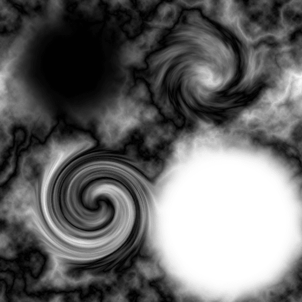
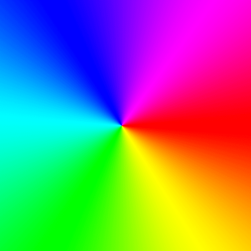
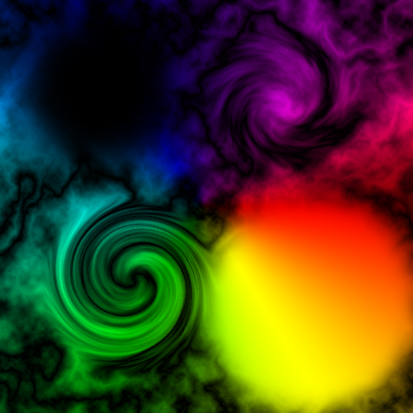

[![LinkedIn][linkedin-shield]][linkedin-url]
# Image Processing
> Applying different photoshop blend modes on 24 bit true-color images.

  
Table of Contents

  <ol>
    <li>
      <a href="#motivation-for-the-project">Motivation for the Project</a>
    </li>
    <li>
      <a href="#overview-of-the-project">Overview of the Project</a>
      <ul>
        <li><a href="#built-with">Built With</a></li>
      </ul>
    </li>
    <li><a href="#tasks">Tasks Performed on the images</a></li>
    <li><a href="#sample">Sample of the Project Execution</a></li>
    <li><a href="#contact">Contact</a></li>
  </ol>

## Motivation for the Project?

to understand how the photoshop blend modes work.

## Overview of the Project.

Lots of applications need to process images in some way. Load them, store them, write them back out to files, scale them, rotate them, adjust the color in part (or all) of the image, etc.

### Built With

* [C++](https://cdn.jsdelivr.net/npm/simple-icons@v3/icons/cplusplus.svg)

## Tasks Performed on the images.

The tasks that are performed on the .TGA files are in the `input folder` and thier respective output are in the `ouput folder`.

The tasks that are performed in the code are commented like `Task 01`

The tasks are following:
* Use the Multiply blending mode to combine “layer1.tga” (top layer) with “pattern1.tga” 
(bottom layer).
* Use the Subtract blending mode to combine “layer2.tga” (top layer) with “car.tga” (bottom 
layer). This mode subtracts the top layer from the bottom layer.
* Use the Multiply blending mode to combine “layer1.tga” with “pattern2.tga”, and store the 
results temporarily. Load the image “text.tga” and, using that as the top layer, combine it with 
the previous results of layer1/pattern2 using the Screen blending mode.
* Multiply “layer2.tga” with “circles.tga”, and store it. Load “pattern2.tga” and, using that as the 
top layer, combine it with the previous result using the Subtract blending mode.
* Combine “layer1.tga” (as the top layer) with “pattern1.tga” using the Overlay blending mode.
* Load “car.tga” and add 200 to the green channel.
* Load “car.tga” and scale (multiply) the red channel by 4, and the blue channel by 0. This will 
increase the intensity of any red in the image, while negating any blue it may have.
* Load “car.tga” and write each channel to a separate file: the red channel should be 
“part8_r.tga”, the green channel should be “part8_g.tga”, and the blue channel should be 
“part8_b.tga”
* Load “layer_red.tga”, “layer_green.tga” and “layer_blue.tga”, and combine the three files into 
one file. The data from “layer_red.tga” is the red channel of the new image, layer_green is 
green, and layer_blue is blue.
* Load “text2.tga”, and rotate it 180 degrees, flipping it upside down. 

## Sample of the Project Execution

this to show how the project works.

The `input` for the `Task 01` is following:

\

and the `output` is:

\

[linkedin-url]: https://www.linkedin.com/in/osama-abdul-ghafoor